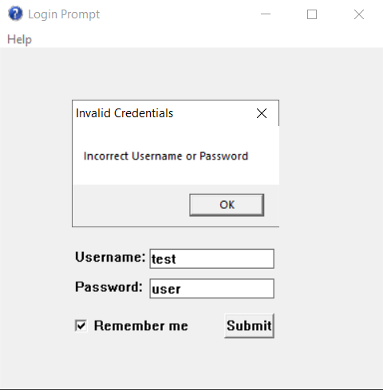

# Login Prompt

## My Setup -
- Code::Blocks with mingw

## Screenshots - 
|   |   |   |
|---|---|---|
||||

## Progress so far -
- Window-specific event handling
- Basic UI for login
- Submit button handling

## Todo -
- Fix username & password validation

## Goals -
- Handle all scenarios & edge-cases
- Sign up implementation
- Working login
- Better styling
